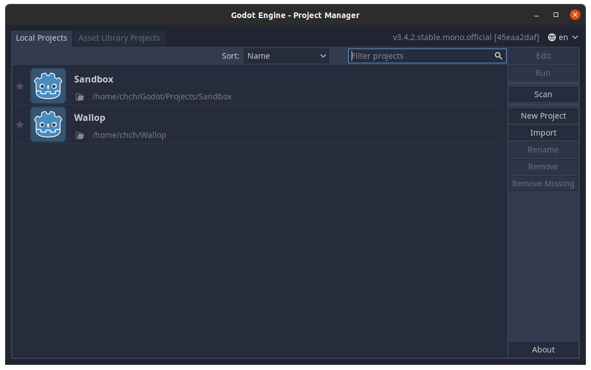
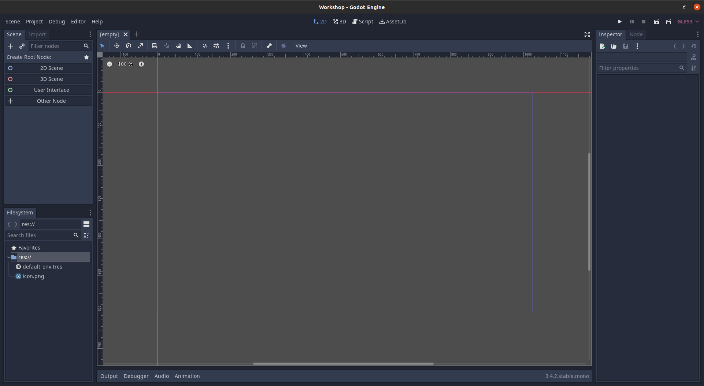
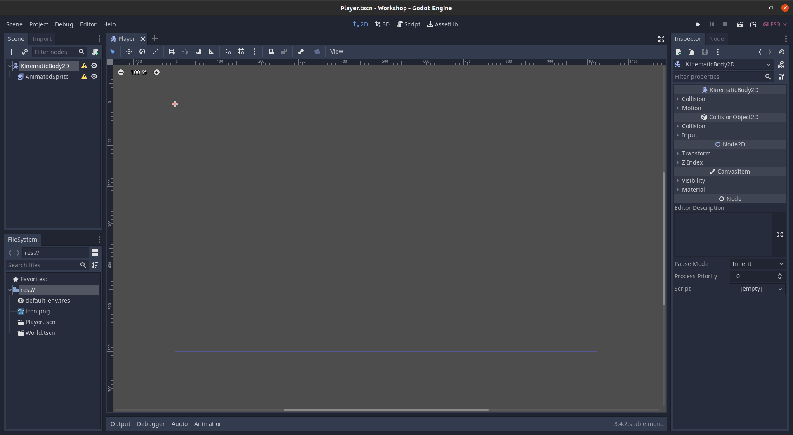
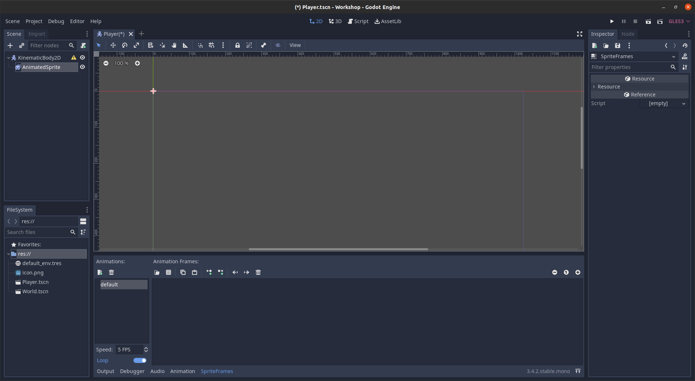
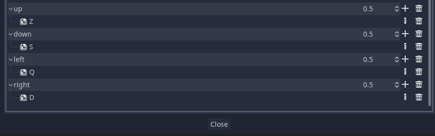
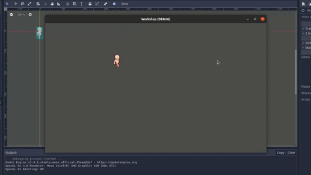
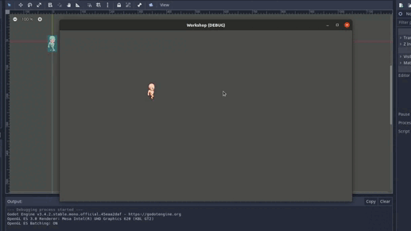

# Workshop shooter en 2D sur Godot
## Introduction
> Godot est un moteur de jeu multiplateforme, c'est-à-dire un logiciel permettant de créer des jeux vidéo qui est compatible avec différents systèmes d'exploitation. Il possède la faculté de pouvoir créer des jeux en 2D ou en 3D avec son propre langage, le GDScript qui ressemble au python.

## Installation

<p align="center">
    <a href="https://godotengine.org/download">
    
    </a>
</p>

Vous n'avez qu'a installer la version standard de godot et de lancer le binaire qui se trouve dedans.
# Création d'un ouveau projet

> Vous allez arriver ici:

<p align="center">
    
    </a>
</p>

Pour créer un nouveau projet, il suffit de faire:

> New Project -> Mettre son nom de projet -> Create folder -> Create & Exit

# Création du monde

Lorsque vous commencez un projet Godot, la première étape est de faire un monde dans lequel vous allez pouvoir placer des objets, players et ennemies. Nous allons donc commencer par créer notre monde en 2D.

Vous arrivez ici après la manipulation précédente:

<p align="center">
    
    </a>
</p>

Commencez par créer une __Scene 2D__.

Et... c'est tout. Vous pouvez maintenant sauvegarder votre monde. N'hésitez pas à renommer votre scene pour plus de clarté.

Vous pouvez maintenant lancer votre monde avec le bouton ▶.

# Création du player

Maintenant que nous avons notre monde, nous pouvons maintenant créer notre player. Ce que nous allons faire, c'est que l'on va créer une autre scène qui sera notre joueur.

## Les caractéristiques du player

Nous voulons que notre player ne soit pas soumis à la gravité car nous voulons avoir le total contrôle sur notre perso. Nous allons créer un __KinematicBody2D__ qui sera la base de notre player. Nous voulons aussi un player animé afin qu'on puisse voir notre player bouger lors de mouvement. Il faut donc hériter la node __AnimatedSprite__ à notre __KinematicBody2D__.

Au final, nous aurons quelque chose de ce genre:

<p align="center">
    
    </a>
</p>

<br>

## Création de l'animation du player

En selectionnant __AnimatedSprite__, on peut créer les frames qui servirera à animer le player. Il suffit d'apuyer sur _Frames_ et de faire un __New SpriteFrame__. Réappuyez sur SpriteFrame et vous allez être sur cette interface:

<p align="center">
    
    </a>
</p>

Vous pouvez dès à présent créer vos animations avec vos sprite sheets. Pour ce faire, vous devez appuyer sur le bouton "Add frames from a Sprite Sheet". Découpez votre sprite sheet afin que l'on puisse récupérer les sprites.

> C'est maintenant à vous de créer les animations de votre players.

# Collision du player

Vous pouvez voir qu'il y a encore une erreur sur le __KinematicBody2D__ et qu'il demande une __CollisionShape2D__. 
> Créez donc en un et placez bien la collision sur votre player.
<br>
# Mouvement du player

Maintenant que votre player est fait, il suffit maintenant de créer un script qui permet de le faire bouger avec les touches du clavier.

## Configuration des touches

Configurez d'abord les touches du clavier dans:
 
>  Project -> Project Settings -> Input Map

Ici, vous allez bind les touches du clavier pour faire bouger le player.

Ca devrait ressembler à ceci:

<p align="center">
    
    </a>
</p>

On peut commencer la partie intéressante: Le code !

## Création du script

> Créez un script qui va se lier au  __KinematicBody2D__ du player.

Nous avons le ```_ready``` qui nous permet d'initialiser le player de ```_process``` qui nous permet de faire des choses chaque frames.

Pour avoir une speed configurable dans l'interface graphique, il suffit de faire un _export_ d'une variable.

> Dans le _process, récupérez les input avec du joueur avec la fonction
> ```__Input.is_action_pressed(string button)__```.

Avec les inputs récupérés, nous pouvons faire bouger notre player avec une certaine vélocité.

> A l'aide de la fonction ```__move_and_slide(velocity)__```, faites bouger votre player avec les inputs récupéré.

> Vous pouvez changer l'animation du player en changeant directant la valeur de __AnimatedSprite__ comme ceci: ```$AnimatedSprite.animation = string```

## Vous avez maintenant un player qui bouge et avec une animation distinct pour chaque direction !


<br>

# Le shooter dans tout ça ?

## > Configuration des touches part 2

> Configurez le clic de souris comme étant le bouton de tir.

## Creation des bullets
Si vous avez bien suivi tout le tuto, vous savez créer une scène, un objet et un script.
> Créez une scène __Bullet__ qui sera la bullet en __KinematicBody2D__, un __Sprite__ et un script qui lui fait avancer tout droit avec une vitesse modifiable via l'interface graphique.

## Instanciation des bullets
Ce qu'on va faire, c'est qu'on va preload la scene __Bullet__, et à chaque fois que l'on tire, on va instancier une __Bullet__.

> ```var bulletScene = preload(path)``` pour preload la scene

> ```var newBullet = bulletScene.instance()``` pour instancier une bullet

Pour que les bullets ne soient perdus après l'instanciation, il faut les rajouter en tant que child du player.

>```add_child(newBullet)``` pour les rajouter en tant qu'enfant du player

## Je crée beaucoup trop de bullet quand je tire !

Il est temps de gérer son temps. Pour cela, rajoutez un __Timer__ au player qui sera donc son cooldown afin de retirer à nouveau.

> Créz un __Timer__ dans le player et mettez le cooldown à 0.5.

> Cochez _one shot_ afin que le __Timer__ commence lorsque l'on le souhaite.

<br>

> ```$Timer.time_left``` pour avoir le temps restant

> ```$Timer.start()``` pour commencer le chrono

On se retrouve avec 2 problèmes:

- Il y a une collision entre la __Bullet__ et le player
- La __Bullet__ suit le player

Pour régler le soucis de la collision, il suffit de changer le layer et le mask de la __Bullet__ dans les collisions.

Pour ce qui est des bullets qui nous suit, il suffit de mettre la __Bullet__ en tant que enfant du monde. Pour ce faire, nous allons devoir travailler dans la scene monde. Pour mettre un player dans le monde, il suffit de glisser la scene dans le monde.

> au lieu d'avoir un ```add_child()```, nous allons avoir un ```get_owner().add_child()```

> Pour set la position des __Bullet__ au player, il faut faire un ```newBullet.set_position(position)```

## Vous avez maintenant un player qui tire des bullets tout droit !

<p align="center">
    
    </a>
</p>

<br>

# Viser la lune ? Ca ne me fait pas peur !

Comment faire pour que les tirs visent la souris ?

## Rotation du sprite
Pour ce faire, il suffit de faire regarder les __Bullets__ dans la direction de la souris. On peut donc le faire regarder une position avec ```look_at(Vector2)``` et avoir la position de la souris avec ```get_global_mouse_position()```.

> faites regarder les __Bullets__ vers la direction de la souris.

## Velocité des Bullets

> changez la vélocité des __Bullets__ afin qu'ils puissent aller vers la souris.

# Conclusion

Grâce à ce tutorial, vous avez appris à créer une scene, ajouter des childs à des nodes, faire des scripts et en plus, vous avez un bonhomme qui tire là où voulez !

<p align="center">
    
    </a>
</p>

## Contributors

- Charlie Chou [![github-link][github-logo]](https://github.com/Chch270)
